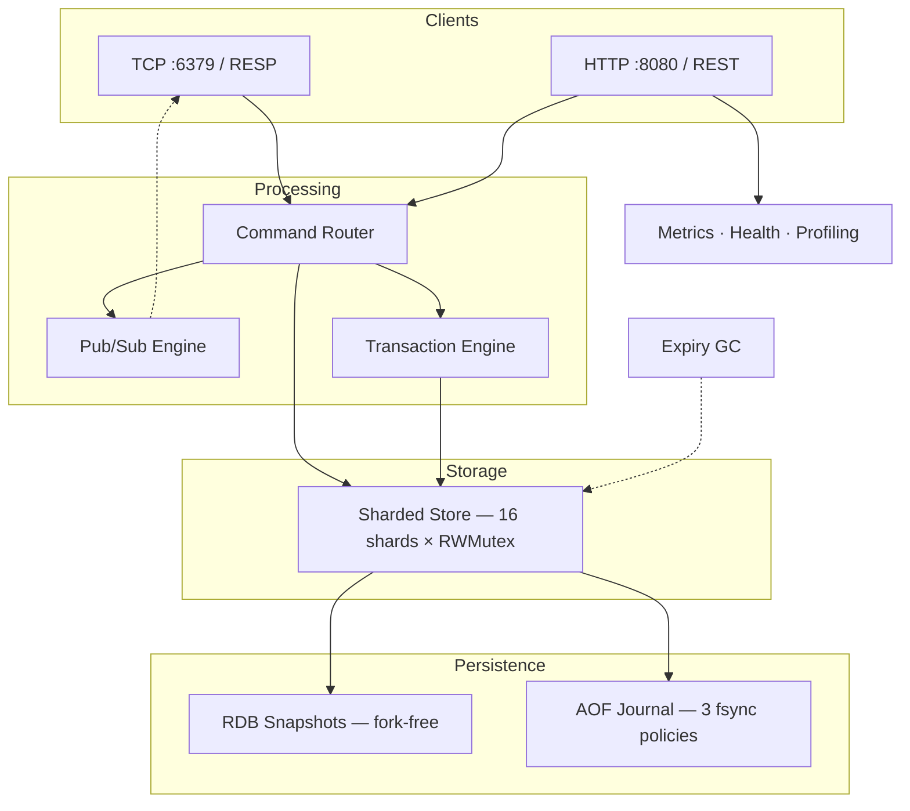

[](https://github.com/hoangNguyenDev3/kache/actions/workflows/ci.yml) [](https://github.com/hoangNguyenDev3/kache) [](LICENSE) [](https://goreportcard.com/report/github.com/hoangNguyenDev3/kache) [](https://github.com/hoangNguyenDev3/kache/releases/latest)

# Kache

A multi-core, Redis-compatible in-memory data store built in Go — optimized where Redis isn't.

## Quick Start

```bash
docker run -p 6379:6379 -p 8080:8080 ghcr.io/hoangnguyendev3/kache:latest
```

## Live Demo

Try Kache without installing anything: [**Launch Demo**](https://kache-demo.vercel.app)

> Interactive web console to SET/GET keys, manage lists and hashes, and monitor server health in real time.

## What I Learned Building This

I built Kache to understand how in-memory databases actually work under the hood. Redis is one of the most widely used pieces of infrastructure, and I wanted to go beyond just using it — I wanted to understand *why* it makes the design choices it does by implementing an alternative from scratch.

Along the way, I learned:

- **Concurrency isn't free** — my first version used a single `sync.Mutex` and was actually slower than single-threaded under parallel load. Sharding the store into 16 independent locks was the fix, and benchmarking proved it scaled linearly with cores.
- **Persistence is harder than storage** — implementing AOF taught me why fsync policies exist (data safety vs. throughput) and why Redis uses `fork()` for snapshots (and why that's expensive in memory).
- **Protocol compatibility matters** — writing a RESP parser from scratch gave me appreciation for how simple, well-designed wire protocols enable interoperability. Any existing Redis client can connect to Kache without changes.
- **Testing concurrent code requires deliberate design** — the `-race` detector caught bugs my unit tests missed. I now write concurrent tests as a first-class concern, not an afterthought.

## Architecture



## Key Features

- Sharded concurrent store (16 shards, per-shard RWMutex)
- Full RESP protocol with pipelining support
- Dual interface: TCP (RESP) + RESTful HTTP API
- RDB snapshots with progressive shard-by-shard saves (no fork, no memory spike)
- AOF journaling with configurable fsync (always/everysec/no)
- Background AOF compaction (BGREWRITEAOF)
- MULTI/EXEC atomic transactions
- Pub/Sub messaging (SUBSCRIBE, PUBLISH, PSUBSCRIBE)
- Redis-style probabilistic key expiry (lazy + active deletion)
- Prometheus metrics and observability
- LIST, Hash, and String data types
- Multi-stage Docker build

## How Kache Compares to Redis

| Aspect | Redis Approach | My Approach | What I Learned |
|--------|---------------|-------------|----------------|
| Threading | Single-threaded event loop | Goroutine-per-connection + sharded store | Single-threaded avoids all lock complexity — multi-threading only pays off with careful sharding |
| Store Locking | N/A (single-threaded) | Per-shard RWMutex (16 shards) | Read-heavy workloads scale linearly when readers don't block each other |
| INCR | Inherently atomic (single-threaded) | Uses `sync/atomic` for lock-free increments | Atomics are only needed *because* I chose multi-threading — Redis avoids this entirely |
| RDB Snapshot | `fork()` + COW (can double memory) | Progressive shard-by-shard under read locks | `fork()` gives a perfect point-in-time snapshot but at a steep memory cost |
| AOF Durability | fsync: always/everysec/no | Same 3 policies, Go-idiomatic implementation | The `everysec` default is a pragmatic balance — at most 1 second of data loss |
| AOF Compaction | BGREWRITEAOF via `fork()` | Background goroutine + atomic rename | Atomic rename ensures crash safety during compaction |
| Key Expiry | Lazy + periodic sampling | Lazy + probabilistic sampling (100ms) | Sampling 20 keys and checking if >25% expired is a clever bounded-cost approach |

## Interesting Problems I Solved

### The Double-Locking Problem in Transactions

When implementing `MULTI/EXEC`, I realized that if a transaction locks all shards upfront, then individual commands inside the transaction would try to acquire the same shard locks again — causing a deadlock. I solved this by creating a `storeOps` interface with two implementations: `Store` (acquires locks) for normal commands and `unlockedStore` (skips locks) for commands inside a transaction. This was my first time using Go interfaces to solve a concurrency problem rather than a polymorphism problem.

### Why My First Benchmark Was Misleading

My initial store used a single `sync.Mutex`. Benchmarks showed great single-core numbers, but parallel performance was *worse* than sequential — goroutines spent most of their time waiting for the lock. Switching to 16 shards with independent `RWMutex` locks made parallel GET scale from 7.5M to 14.8M ops/sec. This taught me that concurrency without parallelism is just overhead.

### Fork-Free Snapshots

Redis uses `fork()` for RDB snapshots, which can double memory usage via copy-on-write pages. Since Go doesn't expose `fork()` easily, I had to find an alternative: snapshotting each shard under its own read lock, one at a time. This means writes to other shards continue during the snapshot. It's not a perfect point-in-time snapshot, but for a single-node store the trade-off is worth it.

## Performance

Benchmarks on Apple M1, Go 1.25. Benchmarking was essential to this project — it's how I discovered that my initial single-mutex design was 3x slower under parallel load, which led directly to the sharded architecture.

| Benchmark | ns/op | ops/sec | Notes |
|-----------|-------|---------|-------|
| Store GET | 134 | ~7.5M | Single-core |
| Store SET | 937 | ~1.1M | Single-core |
| Store INCR | 32 | ~31M | Lock-free atomic |
| Parallel GET | 68 | ~14.8M | Multi-core scaling |
| Parallel SET | 286 | ~3.5M | Multi-core scaling |
| Parallel Mixed (80/20) | 225 | ~4.4M | Realistic workload |
| TCP SET | 55,520 | ~18K | Full protocol stack (includes network round-trip) |
| TCP GET | 55,987 | ~18K | Full protocol stack (includes network round-trip) |
| TCP Pipeline (100 cmds) | 160,732 | ~622K cmds/sec | Batched I/O — ~35x improvement over individual commands |

## Supported Commands

| Category | Commands |
|----------|----------|
| Strings | SET, GET, DEL, INCR |
| Lists | LPUSH, RPUSH, LPOP, RPOP, LLEN, LRANGE, LINDEX, LTRIM |
| Hashes | HSET, HGET, HDEL, HGETALL, HLEN |
| Keys | EXPIRE, TTL, KEYS |
| Transactions | MULTI, EXEC, DISCARD |
| Pub/Sub | SUBSCRIBE, UNSUBSCRIBE, PUBLISH, PSUBSCRIBE, PUNSUBSCRIBE |
| Server | PING, BGSAVE, BGREWRITEAOF |

## Persistence

Kache supports two complementary persistence mechanisms that can be enabled simultaneously:

**RDB Snapshots** — A progressive shard-by-shard snapshot written in a custom binary format with a `KACHE` header. Each shard is serialized under its own read lock, so no full-store freeze is needed. Trigger a background save with the `BGSAVE` command.

**AOF (Append-Only File)** — A RESP-format journal that logs every write command. Supports three fsync policies: `always` (safest), `everysec` (default, good balance), and `no` (OS-managed). Background compaction via the `BGREWRITEAOF` command rewrites the log with only the current dataset, using an atomic rename for crash safety.

## Testing

All tests pass with Go's race detector enabled (`-race`), and code is linted with `golangci-lint`. The test suite covers:

- **Unit tests** — core store operations, hash and list data types
- **Concurrent tests** — parallel increments, concurrent SET/GET, hash operations under contention
- **Protocol tests** — RESP parsing and serialization
- **Integration tests** — full TCP round-trip, HTTP API, pub/sub messaging
- **Benchmark tests** — single-core, multi-core, and TCP pipeline throughput
- **Persistence tests** — RDB save/load, AOF replay
- **Transaction tests** — MULTI/EXEC atomicity and DISCARD

```bash
go test -race ./... -v
go test -bench=. -benchtime=3s ./tests/
```

## Project Structure

```
kache/
├── cmd/            # CLI entry points (root command, server command)
├── resp/           # RESP protocol parser and serializer
├── store/          # Sharded store, hash/list types, RDB, AOF persistence
├── server/         # TCP (RESP) and HTTP (REST) servers
├── pubsub/         # Pub/Sub messaging engine
├── types/          # Shared type definitions
├── tests/          # All test files (unit, integration, benchmark, concurrent)
├── demo/           # Live demo web app (HTML/CSS/JS)
├── Dockerfile      # Multi-stage production build
├── Makefile        # Build and test shortcuts
└── .github/        # CI/CD workflows (lint, test, build, release)
```

## Install

### Pre-built Binaries

Download the latest release for your platform from [GitHub Releases](https://github.com/hoangNguyenDev3/kache/releases/latest).

### From Source

```bash
go build -o kache .
./kache server
```

### Docker

```bash
docker pull ghcr.io/hoangnguyendev3/kache:latest
docker run -p 6379:6379 -p 8080:8080 ghcr.io/hoangnguyendev3/kache:latest
```

## Configuration

| Flag | Default | Description |
|------|---------|-------------|
| `--resp-port` | 6379 | RESP protocol port |
| `--http-port` | 8080 | HTTP API port |
| `--auth-token` | — | Authentication token for HTTP API |
| `--rdb-enabled` | true | Enable RDB persistence |
| `--rdb-path` | dump.rdb | Path to RDB file |
| `--aof-enabled` | true | Enable AOF persistence |
| `--aof-path` | appendonly.aof | Path to AOF file |
| `--aof-fsync` | everysec | AOF fsync policy (always/everysec/no) |
| `--log-level` | info | Logging level (debug, info, warn, error) |
| `--tls-enabled` | false | Enable TLS for TCP and HTTP servers |
| `--tls-cert` | — | Path to TLS certificate file |
| `--tls-key` | — | Path to TLS private key file |

## Security

- **TLS/SSL**: Both TCP and HTTP servers support TLS encryption via `--tls-enabled`, `--tls-cert`, and `--tls-key` flags
- **HTTP Authentication**: Token-based auth for the REST API via `--auth-token`
- **Input Validation**: Configurable limits on array length (1M) and bulk string size (512MB)
- **Connection Timeout**: 30-second idle timeout for TCP connections

## Observability

- **Prometheus Metrics**: `/metrics` endpoint for scraping
- **Health Check**: `/health` endpoint returning uptime, version, and goroutine count
- **Profiling**: Full `/debug/pprof/` endpoints for CPU, memory, goroutine, and mutex profiling
- **Structured Logging**: JSON/text structured logs via Go's `slog` with configurable log levels

## Roadmap

- SET and SORTED SET data types
- Clustering and replication
- Lua scripting (EVAL/EVALSHA)
- ACL/permission model

## Contributing

Contributions are welcome! Please read our [Contributing Guidelines](CONTRIBUTING.md) before submitting a pull request.
