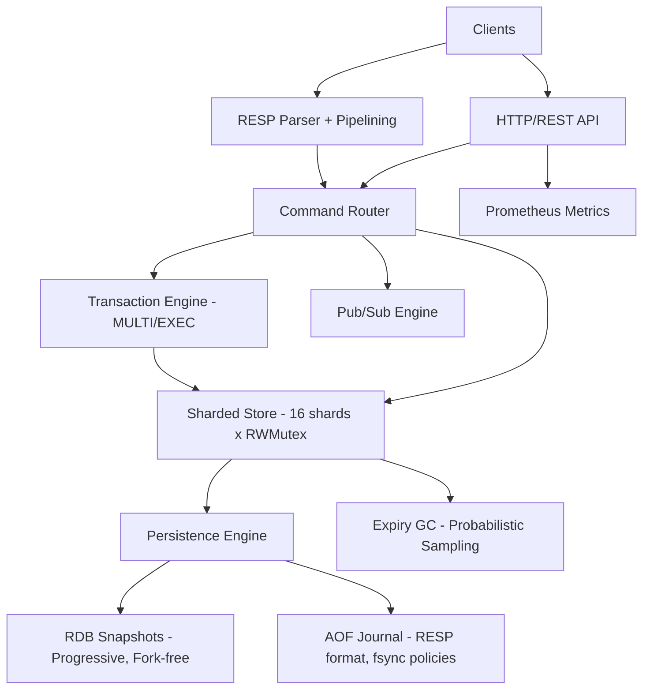

[](https://github.com/hoangNguyenDev3/kache/actions/workflows/ci.yml) [](https://github.com/hoangNguyenDev3/kache) [](LICENSE) [](https://goreportcard.com/report/github.com/hoangNguyenDev3/kache) [](https://codecov.io/gh/hoangNguyenDev3/kache) [](https://github.com/hoangNguyenDev3/kache/releases/latest)

# Kache

A multi-core, Redis-compatible in-memory data store built in Go — optimized where Redis isn't.

## Live Demo

Try Kache without installing anything: [**Launch Demo**](https://kache.vercel.app)

> Interactive web console to SET/GET keys, manage lists and hashes, and monitor server health in real time.

## Why Kache?

Redis is single-threaded. Kache uses Go's goroutine-per-connection model with a sharded store to exploit multi-core CPUs. It implements Redis-compatible persistence with a fork-free approach that eliminates Redis' memory-doubling problem during snapshots.

## Key Features

- Sharded concurrent store (16 shards, per-shard RWMutex)
- Full RESP protocol with pipelining support
- Dual interface: TCP (RESP) + RESTful HTTP API
- RDB snapshots with progressive shard-by-shard saves (no fork, no memory spike)
- AOF journaling with configurable fsync (always/everysec/no)
- Background AOF compaction (BGREWRITEAOF)
- MULTI/EXEC atomic transactions
- Pub/Sub messaging (SUBSCRIBE, PUBLISH, PSUBSCRIBE)
- Redis-style probabilistic key expiry (lazy + active deletion)
- Prometheus metrics and observability
- LIST, Hash, and String data types
- Multi-stage Docker build

## Design Decisions vs Redis

| Aspect | Redis | Kache | Why |
|--------|-------|-------|-----|
| Threading | Single-threaded event loop | Goroutine-per-connection + sharded store | Utilizes all CPU cores |
| Store Locking | N/A (single-threaded) | Per-shard RWMutex | Concurrent reads scale linearly |
| INCR | Inherently atomic (single-threaded) | sync/atomic — zero lock contention | 31M ops/sec lock-free |
| RDB Snapshot | fork() + COW (doubles memory) | Progressive shard-by-shard under read locks | No fork, no memory spike |
| AOF Durability | fsync: always/everysec/no | Same 3 policies, Go-idiomatic | Matches Redis semantics |
| AOF Compaction | BGREWRITEAOF via fork() | Background goroutine, atomic rename | Fork-free |
| Key Expiry | Lazy + periodic | Lazy + probabilistic sampling (100ms) | Same algorithm, Go goroutines |

## Architecture



## Performance

Benchmarks on Apple M1, Go 1.21:

| Benchmark | ns/op | ops/sec | Notes |
|-----------|-------|---------|-------|
| Store GET | 134 | ~7.5M | Single-core |
| Store SET | 937 | ~1.1M | Single-core |
| Store INCR | 32 | ~31M | Lock-free atomic |
| Parallel GET | 68 | ~14.8M | Multi-core scaling |
| Parallel SET | 286 | ~3.5M | Multi-core scaling |
| Parallel Mixed (80/20) | 225 | ~4.4M | Realistic workload |
| TCP SET | 55,520 | ~18K | Full protocol stack |
| TCP GET | 55,987 | ~18K | Full protocol stack |
| TCP Pipeline (100 cmds) | 160,732 | ~622K cmds/sec | Batched I/O |

## Supported Commands

| Category | Commands |
|----------|----------|
| Strings | SET, GET, DEL, INCR |
| Lists | LPUSH, RPUSH, LPOP, RPOP, LLEN, LRANGE, LINDEX, LTRIM |
| Hashes | HSET, HGET, HDEL, HGETALL, HLEN |
| Keys | EXPIRE, TTL, KEYS |
| Transactions | MULTI, EXEC, DISCARD |
| Pub/Sub | SUBSCRIBE, UNSUBSCRIBE, PUBLISH, PSUBSCRIBE, PUNSUBSCRIBE |
| Server | PING, BGSAVE, BGREWRITEAOF |

## Persistence

Kache supports two complementary persistence mechanisms that can be enabled simultaneously:

**RDB Snapshots** — A progressive shard-by-shard snapshot written in a custom binary format with a `KACHE` header. Each shard is serialized under its own read lock, so no full-store freeze is needed. Trigger a background save with the `BGSAVE` command.

**AOF (Append-Only File)** — A RESP-format journal that logs every write command. Supports three fsync policies: `always` (safest), `everysec` (default, good balance), and `no` (OS-managed). Background compaction via the `BGREWRITEAOF` command rewrites the log with only the current dataset, using an atomic rename for crash safety.

## Install

### Pre-built Binaries

Download the latest release for your platform from [GitHub Releases](https://github.com/hoangNguyenDev3/kache/releases/latest).

### From Source

```bash
go build -o kache .
./kache server
```

### Docker

```bash
docker pull ghcr.io/hoangnguyendev3/kache:latest
docker run -p 6379:6379 -p 8080:8080 ghcr.io/hoangnguyendev3/kache:latest
```

## Configuration

| Flag | Default | Description |
|------|---------|-------------|
| `--resp-port` | 6379 | RESP protocol port |
| `--http-port` | 8080 | HTTP API port |
| `--auth-token` | — | Authentication token for HTTP API |
| `--rdb-enabled` | true | Enable RDB persistence |
| `--rdb-path` | dump.rdb | Path to RDB file |
| `--aof-enabled` | true | Enable AOF persistence |
| `--aof-path` | appendonly.aof | Path to AOF file |
| `--aof-fsync` | everysec | AOF fsync policy (always/everysec/no) |
| `--log-level` | info | Logging level (debug, info, warn, error) |
| `--tls-enabled` | false | Enable TLS for TCP and HTTP servers |
| `--tls-cert` | — | Path to TLS certificate file |
| `--tls-key` | — | Path to TLS private key file |

## Security

- **TLS/SSL**: Both TCP and HTTP servers support TLS encryption via `--tls-enabled`, `--tls-cert`, and `--tls-key` flags
- **HTTP Authentication**: Token-based auth for the REST API via `--auth-token`
- **Input Validation**: Configurable limits on array length (1M) and bulk string size (512MB)
- **Connection Timeout**: 30-second idle timeout for TCP connections

## Observability

- **Prometheus Metrics**: `/metrics` endpoint for scraping
- **Health Check**: `/health` endpoint returning uptime, version, and goroutine count
- **Profiling**: Full `/debug/pprof/` endpoints for CPU, memory, goroutine, and mutex profiling
- **Structured Logging**: JSON/text structured logs via Go's `slog` with configurable log levels

## Running Tests

```bash
go test ./... -v
go test -bench=. -benchtime=3s ./tests/
```

## Limitations

- Single-node only — no clustering or replication (yet)
- No Lua scripting (EVAL/EVALSHA)
- No ACL/permission model — authentication is token-based only
- No SET or SORTED SET data types (planned)

## Contributing

Contributions are welcome! Please read our [Contributing Guidelines](CONTRIBUTING.md) before submitting a pull request.

## Future Work

- SET and SORTED SET data types
- Clustering and replication
- Lua scripting (EVAL/EVALSHA)
